<!-- ===== HEADER ===== -->

# 🕊️ Welcome to **Yaosir's GitHub** 🍀  
*Robotique • Café • Paix*

---

## 🧩 About Me

🤖 Passionate about **Robotics**  
☕ Heavy **Coffee** Enthusiast  
🕊️ Believer in a **Peaceful World**  
🌟 *"Stay hungry, stay foolish." — Steve Jobs*

---

<h2 align="center">🌏 Overview</h2>

<table align="center" width="100%">
  <tr>
    <td width="50%" valign="top">
      
    </td>
    <td width="50%" valign="top">
      
    </td>
  </tr>
</table>

---

## 📚 Latest Blog Posts

<!-- BLOG-POST-LIST:START -->
- [Kazam产生.movie.mux后恢复视频为.mp4](https://blog.csdn.net/qq_60865111/article/details/149882889)
- [在HP暗影精灵Ubuntu20.04上修复IntelAX211Wi-Fi不可用的全过程记录——系统安装以后没有WIFI图标&amp;无法使用无线网](https://blog.csdn.net/qq_60865111/article/details/149123368)
- [工业表面缺陷检测开源数据集汇总](https://blog.csdn.net/qq_60865111/article/details/149000368)
- [Git 推送失败解决教程——error: failed to push some refs to](https://blog.csdn.net/qq_60865111/article/details/148456311)
- [Ubuntu下安装Intel MKL完整指南](https://blog.csdn.net/qq_60865111/article/details/147261872)
<!-- BLOG-POST-LIST:END -->

---

## 🏆 Achievements

---

  🌸🌸 <i>Code is Beautiful Poetry</i> 🌸🌸

<!-- GitHub Activity Graph GitHub 活动图 -->

<!--
---

## 🏆 Achievements

---

<!--
**BreCaspian/BreCaspian** is a ✨ _special_ ✨ repository because its `README.md` (this file) appears on your GitHub profile.

profile-3d-contrib/profile-green-animate.svg
样式：绿色动态主题
特点：以绿色为主色调，带有动态动画效果，展示您的GitHub贡献记录（如提交、PR等）。
profile-3d-contrib/profile-green.svg
样式：绿色静态主题
特点：与绿色动态版类似，但没有动画效果，适合静态展示。
profile-3d-contrib/profile-season-animate.svg
样式：季节动态主题
特点：根据当前季节（春、夏、秋、冬）自动调整颜色和背景，并带有动态效果。
profile-3d-contrib/profile-season.svg
样式：季节静态主题
特点：与季节动态版类似，但无动画，颜色随季节变化。
profile-3d-contrib/profile-south-season-animate.svg
样式：南半球季节动态主题
特点：专为南半球用户设计，季节与北半球相反（例如北半球夏季时，南半球为冬季），带有动态效果。
profile-3d-contrib/profile-south-season.svg
样式：南半球季节静态主题
特点：南半球季节主题的静态版本，无动画效果。
profile-3d-contrib/profile-night-view.svg
样式：夜景主题
特点：以深色背景和星空效果展示，模拟夜间景观，静态展示。
profile-3d-contrib/profile-night-green.svg
样式：夜间绿色主题
特点：夜景背景搭配绿色贡献块，静态展示。
profile-3d-contrib/profile-night-rainbow.svg
样式：夜间彩虹主题
特点：夜景背景搭配彩虹色贡献块，静态展示。
profile-3d-contrib/profile-gitblock.svg
样式：Git块主题
特点：以GitHub风格的方块形式展示贡献，静态展示。

  leetcode

 
 
 小徽章

  

-----------------------------------------------------------------------------------------------------------------------

<!--
  
&nbsp;

  
  
  
    
  
  
  
  
  
  
  

<h1 style="color: #FFA500;">Welcome to Yaosir's GitHub ! 🍀</h1>

  

    
    
    
    
  

  

    
    
    
  

<!--
----------------------------------------------------------------------------------------------------------------------------------------------------------------------------

## 📊 GitHub Overview

<table style="width:100%; border-collapse:collapse; border:none; border-spacing:0;">
  <tr>
    <td style="padding:0; border:none; vertical-align:top; width:50%;">
      
    </td>
    <td style="padding:0; border:none; vertical-align:top; width:50%;">
      
    </td>
  </tr>
</table>

---

---
-->

<!--
---------------------------------------------------------------------------------------------------------------------

 👋 

Here are some ideas to get you started:

- 🔭 I’m currently working on ...
- 🌱 I’m currently learning ...
- 👯 I’m looking to collaborate on ...
- 🤔 I’m looking for help with ...
- 💬 Ask me about ...
- 📫 How to reach me: ...
- 😄 Pronouns: ...
- ⚡ Fun fact: ...
-->

